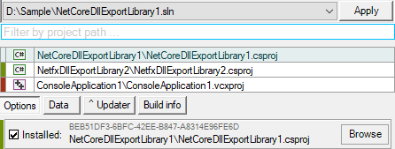

[](https://github.com/3F/MvsSln) [**MvsSln**](https://github.com/3F/MvsSln)

Customizable VisualStudio .sln parser, Complex support of the projects (.vcxproj, .csproj., …), Pluginable lightweight r/w handlers at runtime, and more … 🧩

```r
Copyright (c) 2013-2022  Denis Kuzmin <x-3F@outlook.com> github/3F
```

[ 「 <sub>@</sub> ☕ 」 ](https://3F.github.io/Donation/) [](https://github.com/3F/MvsSln/blob/master/License.txt)

MvsSln contributors https://github.com/3F/MvsSln/graphs/contributors

We're waiting for your awesome contributions!

<table><tr><td>

| Releases    | Windows | Linux
|-------------|---------|--------
| [📦 ](https://www.nuget.org/packages/MvsSln/) | [](https://ci.appveyor.com/project/3Fs/mvssln-fxjnf/branch/master) | [](https://ci.appveyor.com/project/3Fs/mvssln-2d2c2/branch/master) 
| [](https://github.com/3F/MvsSln/releases/latest) | [](https://ci.appveyor.com/project/3Fs/mvssln-fxjnf/build/tests) 

</td><td>

[](https://ci.appveyor.com/project/3Fs/mvssln-fxjnf/history)

</td></tr></table>

## Why MvsSln ?

MvsSln provides the easiest way to complex work with Visual Studio .sln files and referenced projects (.vcxproj, .csproj., ...). Merge, Manage, Attach custom handlers and more. Because it's free, because it's open.

🌌 The most convenient work with projects, dependencies, their lazy loading, any folders, any items, references and much more in these different worlds;

💡 We are customizable and extensible library at runtime! Make **your custom** .sln and its parsing for everything you like at the moment you need just in a few steps;

🚀 We were born from other popular project to be more loyal for your preferences on the fly. Hello from 2013;

Even if you just need the basic access to information or more complex work through our readers and writers.

Create/modify/or just use parsed folders, projects, and other. 

Safely compare anything, 

```csharp
if(new ProjectItem(...) == new ProjectItem(...)) { ... }
if(new SolutionFolder(...) == new SolutionFolder(...)) { ... }
if(new RawText(...) == new RawText(...)) { ... }
if(new ConfigItem(...) == new ConfigItem(...)) { ... }
if(new PackageInfo(...) == new PackageInfo(...)) { ... }
````


Use 📂 Subdirectories,

```csharp
new SolutionFolder("dir1", 
    new SolutionFolder("dir2", 
        new SolutionFolder("dir3", "hMSBuild.bat", "DllExport.bat")
    )
);
...
new SolutionFolder("{EE7DD6B7-56F4-478D-8745-3D204D915473}", "MyFolder2", dir1, ".gnt\\gnt.core");
...
```

Projects and Folders,

```csharp
new ProjectItem("Project1", ProjectType.Cs);
new ProjectItem("Project1", ProjectType.Cs, new SolutionFolder("dir1"));
new ProjectItem("Project2", ProjectType.Vc, "path 1");
new ProjectItem("{EE7DD6B7-56F4-478D-8745-3D204D915473}", "Project1", ProjectType.Cs, dir2);
...
```

Detect the real\* project types,

```csharp
* IsCs() - Checking both legacy `ProjectType.Cs` and modern `ProjectType.CsSdk` types.
. . .
* IsSdk() - While ProjectType cannot inform the actual use of the modern Sdk style in projects,
            current method will try to detect this by using the extended logic:
            https://github.com/dotnet/project-system/blob/master/docs/opening-with-new-project-system.md
```

Load only what is needed at the moment,

```csharp
// https://github.com/3F/MvsSln/discussions/49

using var sln = new Sln("Input.sln", SlnItems.Env);

sln.Result.Env
    .LoadProjects(sln.Result.ProjectItemsConfigs.Where(p => p.project.IsCs()))
    .ForEach(xp =>
    {
        xp.AddItem("Compile", @"financial\Invoice.cs");
    });
```

Modify *.sln* at runtime,

https://github.com/3F/MvsSln/discussions/43#discussioncomment-371185

```csharp
// new collection from available projects but without project 'UnLib'
var projects = sln.Result.ProjectItems.Where(p => p.name != "UnLib");

// prepare write-handlers
var whandlers = new Dictionary<Type, HandlerValue>() {
    [typeof(LProject)] = new HandlerValue(new WProject(projects, sln.Result.ProjectDependencies)),
};

// save result
using(var w = new SlnWriter(@"modified.sln", whandlers)) {
    w.Write(sln.Result.Map);
}
```

Manage [packages.config](https://github.com/3F/MvsSln/pull/30),

```csharp
// 2.6+
using Sln l = new("Input.sln", SlnItems.AllNoLoad | SlnItems.PackagesConfig);

IPackageInfo found = l.Result.PackagesConfigs
                                .SelectMany(s => s.Packages)
                                .FirstOrDefault(p => p.Id.StartsWith("Microsoft."));
// found.MetaTFM ...

Version v = l.Result.PackagesConfigs.First().GetPackage("LX4Cnh")?.VersionParsed;
```

Everything at hand,

```csharp
using(var sln = new Sln(@"D:\projects\Conari\Conari.sln", SlnItems.All & ~SlnItems.ProjectDependencies))
{
    //sln.Result.Env.XProjectByGuid(
    //    sln.Result.ProjectDependencies.FirstBy(BuildType.Rebuild).pGuid,
    //    new ConfigItem("Debug", "Any CPU")
    //);

    var p = sln.Result.Env.GetOrLoadProject(
        sln.ProjectItems.FirstOrDefault(p => p.name == name)
    );

    var paths = sln.Result.ProjectItems
                            .Select(p => new { p.pGuid, p.fullPath })
                            .ToDictionary(p => p.pGuid, p => p.fullPath);

    // {[{27152FD4-7B94-4AF0-A7ED-BE7E7A196D57}, D:\projects\Conari\Conari\Conari.csproj]}
    // {[{0AEEC49E-07A5-4A55-9673-9346C3A7BC03}, D:\projects\Conari\ConariTest\ConariTest.csproj]}

    foreach(IXProject xp in sln.Result.Env.Projects)
    {
        xp.AddReference(typeof(JsonConverter).Assembly, true);
        xp.AddReference("System.Core");

        ProjectItem prj = ...
        xp.AddProjectReference(prj);

        xp.AddImport("../packages/DllExport.1.5.1/tools/net.r_eg.DllExport.targets", true);

        xp.SetProperty("JsonConverter", "30ad4fe6b2a6aeed", "'$(Configuration)' == 'Debug'");
        xp.SetProperties
        (
            new[]
            {
                new PropertyItem("IsCrossTargetingBuild", "true"),
                new PropertyItem("CSharpTargetsPath", "$(MSBToolsLocal)\\CrossTargeting.targets")
            },
            "!Exists('$(MSBuildToolsPath)\\Microsoft.CSharp.targets')"
        );
        // ...
    }

    sln.Result.ProjectConfigs.Where(c => c.Sln.Configuration == "Debug"); // project-cfgs by solution-cfgs
    // ...

} // release all loaded projects
```

And something more,

```csharp
// https://github.com/3F/MvsSln/discussions/42

using var sln = new Sln("TestStruct.sln", SlnItems.Env);
//...
sln.Result.Env.Projects.ForEach(xp => 
    xp.Project.Xml.PropertyGroups.Where(p => p.Condition.Contains("'$(Configuration)|$(Platform)'"))
    .Where(p =>
        sln.Result.ProjectItemsConfigs.All(s => 
            !p.Condition.Contains($"'{s.projectConfig.ConfigurationByRule}|{s.projectConfig.PlatformByRule}'")
        )
    ).ForEach(p => p.Parent?.RemoveChild(p))
);
```

The any new solution handler (reader or writer) can be easily added because of our flexible architecture.

Control anything and have fun !

> MvsSln was specially extracted and re-licensed from *vsSolutionBuildEvent* projects (GPL -> MIT) for https://github.com/3F/DllExport and others! Join us 🎈

## High quality Project Icons. Visual Studio

Since Microsoft officially distributes [5,000 high quality free icons and bitmaps](https://twitter.com/GitHub3F/status/1219348325729816578) from products like Visual Studio,

You can also use related project icons together with MvsSln like it was already for .NET DllExport project:



Follow License Terms for icons and Find implementation in original repo: [https://github.com/3F/DllExport](https://github.com/3F/DllExport)

## How or Where is used

Let's consider examples of use in real projects below.

### .NET DllExport

DllExport project finally changed distribution of the packages starting with v1.6 release. The final manager now fully works via MvsSln:

* https://github.com/3F/DllExport/wiki/DllExport-Manager


MvsSln also is **a core logic** in *Post-Processing* feature [[?]](https://github.com/3F/DllExport/pull/148)


### vsSolutionBuildEvent

vsSolutionBuildEvent now is completely integrated with MvsSln [[?](https://github.com/3F/vsSolutionBuildEvent/pull/53)]

Fully removed original parser and replaced related processing from Environment/IsolatedEnv/MSBuild/CIM. Now it just contains lightweight invoking of relevant methods.

https://github.com/3F/vsSolutionBuildEvent


## Map of .sln & Writers

v2+ now also may provide map of analyzed data. To enable this, define a bit **0x0080** for type of operations to parser.

Parser will expose map through list of `ISection` for each line. For example:


* Each section contains handler which processes this line + simple access via RawText if not.
* All this may be overloaded by any custom handlers (readers - `ISlnHandler`) if it's required by your environment.

This map may be used for modification / define new .sln data through writers (`IObjHandler`). For example:

```csharp
var data = new List<IConfPlatform>() {
    new ConfigSln("Debug", "Any CPU"),
    new ConfigSln("Release_net45", "x64"),
    new ConfigSln("Release", "Any CPU"),
};

var whandlers = new Dictionary<Type, HandlerValue>() {
    [typeof(LSolutionConfigurationPlatforms)] = new HandlerValue(new WSolutionConfigurationPlatforms(data)),
};

using(var w = new SlnWriter("<path_to>.sln", whandlers)) {
    w.Write(map);
}
```

## Did you know 

### Projects

The 1 project instance means only the 1 project with specific configuration. That is, you should work with each instance separately if some project has 2 or more configurations:

```
First instance of project {4F8BB8CD-1116-4F07-9B8F-06D69FB8589B} with configuration 'Release_net45|Any CPU' that's related with solution cfg -> CI_Release_net45|Any CPU
Second instance of project {4F8BB8CD-1116-4F07-9B8F-06D69FB8589B} with configuration 'Debug|Any CPU' that's related with solution cfg -> Debug|Any CPU
...
```

For example, the [vsSolutionBuildEvent](https://github.com/3F/vsSolutionBuildEvent) contains 10 projects and 8 solution configurations:

```
DBG_SDK10; DBG_SDK15; DCI_SDK10; DCI_SDK15; REL_SDK10; REL_SDK15; RCI_SDK10; RCI_SDK15
```

Maximum **possible** configurations for each projects above should be calculated as 10 * 8 = 80, ie. 80 instances that *can be* loaded as each different project. `EnvWithProjects` will try load all available, but in fact, mostly 2 or more project-configuration can be related to the same 1 solution-configuration, therefore it can be just 30 or even 20 in reality, and so on.

However, if you need to work only with common data of specified project:
* Just use any available configuration. That is, to load projects only with specific configuration, use for example `IEnvironment.LoadProjects`.

```csharp
// SlnItems.Env will initialize environment without loading projects.
using(var sln = new Sln(@"vsSolutionBuildEvent.sln", SlnItems.Env))
{
    ISlnResult data         = sln.Result;
    IConfPlatform slnCfg    = data.SolutionConfigs.FirstOrDefault(); // to get first available solution configuration
    data.Env.LoadProjects(
        // prepare final list of projects that should be loaded
        data.ProjectItemsConfigs.Where(p => p.solutionConfig == slnCfg)
    );    
    //... data.Env.Projects will contain instances only for Where(p => p.solutionConfig == slnCfg) i.e. 8 in total
}
```

**For modern versions** also available `IEnvironment.LoadMinimalProjects` or `EnvWithMinimalProjects` flag.

### Adding Reference & Assembly name

```csharp
XProject.AddReference(lib, false);
```

```xml
<Reference Include="DllExport, Version=1.6.4.15293, Culture=neutral, PublicKeyToken=8337224c9ad9e356">
  <HintPath>..\packages\DllExport.1.6.4\gcache\metalib\DllExport.dll</HintPath>
  <Private>False</Private>
</Reference>
```

```csharp
XProject.AddReference("DllExport", lib, false);
```

```xml
<Reference Include="DllExport">
  <HintPath>..\packages\DllExport.1.6.4\gcache\metalib\DllExport.dll</HintPath>
  <Private>False</Private>
</Reference>
```

You can also specify it via `System.Reflection.Assembly` etc.

## Example of extending (your custom handlers)

Example of `LProject` handler (**reader**):

```csharp
public class LProject: LAbstract, ISlnHandler
{
    public override bool IsActivated(ISvc svc)
    {
        return ((svc.Sln.ResultType & SlnItems.Projects) == SlnItems.Projects);
    }

    public override bool Condition(RawText line)
    {
        return line.trimmed.StartsWith("Project(", StringComparison.Ordinal);
    }

    public override bool Positioned(ISvc svc, RawText line)
    {
        var pItem = GetProjectItem(line.trimmed, svc.Sln.SolutionDir);
        if(pItem.pGuid == null) {
            return false;
        }

        if(svc.Sln.ProjectItemList == null) {
            svc.Sln.ProjectItemList = new List<ProjectItem>();
        }

        svc.Sln.ProjectItemList.Add(pItem);
        return true;
    }
}
```

Example of `WSolutionConfigurationPlatforms` handler (**writer**):

```csharp
public class WSolutionConfigurationPlatforms: WAbstract, IObjHandler
{
    protected IEnumerable<IConfPlatform> configs;

    public override string Extract(object data)
    {
        var sb = new StringBuilder();

        sb.AppendLine($"{SP}GlobalSection(SolutionConfigurationPlatforms) = preSolution");

        configs.ForEach(cfg => sb.AppendLine($"{SP}{SP}{cfg} = {cfg}"));

        sb.Append($"{SP}EndGlobalSection");

        return sb.ToString();
    }

    public WSolutionConfigurationPlatforms(IEnumerable<IConfPlatform> configs)
    {
        this.configs = configs ?? throw new ArgumentNullException();
    }
}
```

## How to get MvsSln

* NuGet: [](https://www.nuget.org/packages/MvsSln/)
* [GetNuTool](https://github.com/3F/GetNuTool): `msbuild gnt.core /p:ngpackages="MvsSln"` or **[gnt](https://3f.github.io/GetNuTool/releases/latest/gnt/)** /p:ngpackages="MvsSln"
* [GitHub Releases](https://github.com/3F/MvsSln/releases) [ [latest](https://github.com/3F/MvsSln/releases/latest) ]
* CI builds: [`CI /artifacts`](https://ci.appveyor.com/project/3Fs/mvssln-fxjnf/history) ( [old CI](https://ci.appveyor.com/project/3Fs/mvssln/history) ) or find `🎲 CI build` on [GitHub Releases](https://github.com/3F/MvsSln/releases) page.
